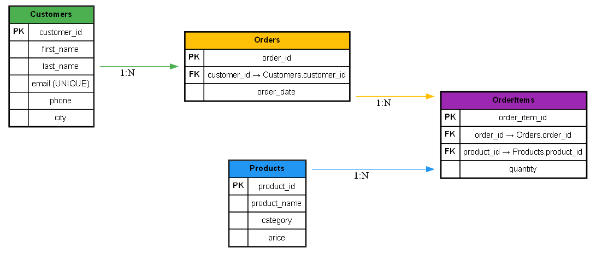

# 🛒 Retail Store Database – Aggregate Functions & Grouping

## 📌 Introduction
This project is designed to practice **SQL aggregate functions** and **grouping** using a **Retail Store Management System** dataset.

We practice:
- Aggregate functions: `SUM`, `COUNT`, `AVG`, `MIN`, `MAX`
- Grouping with `GROUP BY`
- Filtering grouped results with `HAVING`

## 🚀 How to Run
1. Open **DB Browser for SQLite** (or MySQL Workbench).
2. Create a new database `Retail_store.db`.
3. Run `schema.sql` to create tables.
4. Run `data.sql` to insert sample data.
5. Run `queries.sql` to try out aggregate queries.

## 📂 Files
- `schema.sql` → Database schema (Customers, Products, Orders, OrderItems)
- `data.sql` → Sample dataset
- `queries.sql` → Example aggregate & grouping queries
- `docs/er_diagram.png` → ER Diagram

## 📊 ER Diagram

## ✅ Outcome
After completing this, you’ll be able to:
- Summarize numeric columns with aggregates
- Group data by categories
- Filter groups using `HAVING`
- Analyze sales & customer/order trends
